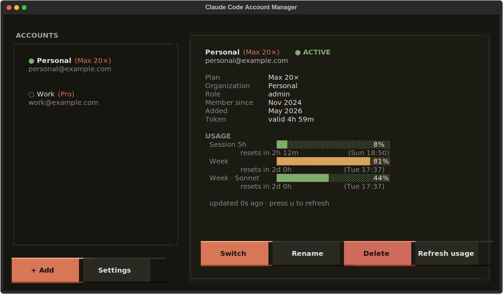
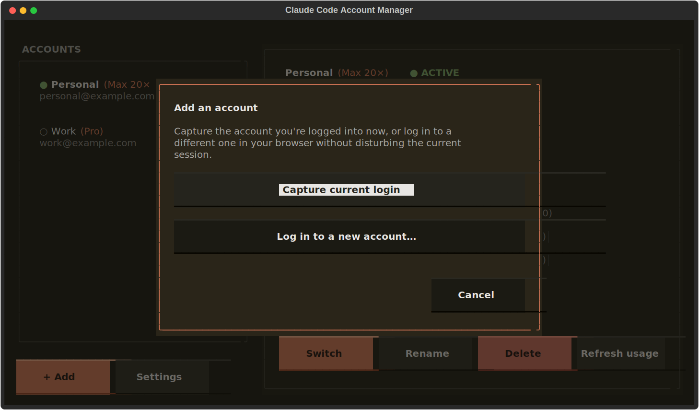
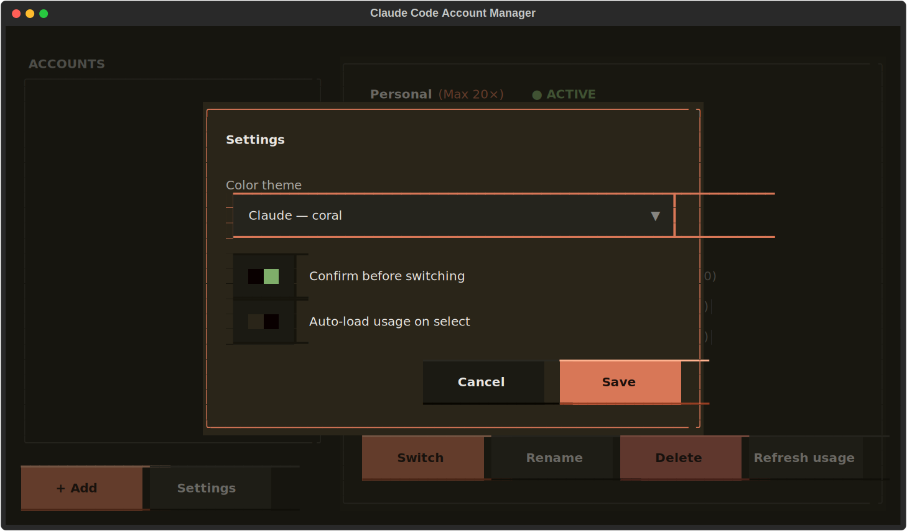
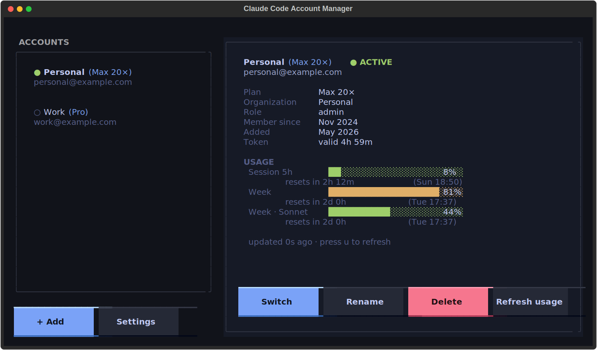

# Claude Code Account Manager

Easy way to switch between Claude accounts: pick one, press Enter,
done. It runs in your terminal and shows each account's plan, organization, and **live
usage** — how much of your 5-hour and weekly limits you've burned, and when they reset.

<p align="center">
  
</p>

I made it because running a personal Max account next to a work account meant logging
out and back in through the browser every single time. This keeps every login saved and
swaps the active one in place.

## Install

Python 3.11+ and two packages:

```
pip install -r requirements.txt
```

## Getting around

Pick an account on the left, read its details on the right. Everything has both a key
and a button:

|                   |                            |
| ----------------- | -------------------------- |
| `↑` `↓`     | move between accounts      |
| `Enter` / `s` | switch to the selected one |
| `a`             | add an account             |
| `r` · `d`    | rename · remove           |
| `u`             | refresh usage              |
| `,`             | settings                   |
| `q`             | quit                       |

### Adding an account

Press `a` (or **+ Add**) and you get two ways in:

<p align="center">
  
</p>

- **Capture current login** saves whoever you're signed in as right now.
- **Log in to a new account** opens your browser; you sign in as the *other* account and
  paste the code back. Your current session stays untouched, so you can stack up several
  accounts before switching for the first time.

### Usage and limits

The detail pane pulls live numbers from the same Anthropic endpoint Claude Code uses, so
you see exactly where each account stands — bars go green → amber → red as you approach a
limit, with the reset time right beside them. Usage for an account you're *not* currently
on works too; CAM refreshes its token behind the scenes when needed.

### Themes and settings

Five themes and a couple of behavior toggles, under settings (`,`). The theme previews as
you scroll through it.

<p align="center">
  
</p>

Midnight, for instance:

<p align="center">
  
</p>

## How switching actually works

Claude Code keeps your login in two places:

- the OAuth tokens — `~/.claude/.credentials.json` on Linux and Windows; the
  **macOS Keychain** (service `Claude Code-credentials`) on Mac
- `~/.claude.json` — everything else, including *which account you are* (`oauthAccount`)

Switching writes the chosen account's tokens into the first location and its identity into
the second, and leaves everything else alone — your MCP server logins, project history, and
settings all stay put. On macOS, CAM shells out to `security add-generic-password` to
update the Keychain entry (you may get a one-time access prompt the first time). Each
write is atomic, and the previous state is backed up first to
`~/.claude-account-manager/backups/`.

One thing to know: a Claude Code session that's already open is holding the old account in
memory. Switch first, then start a fresh `claude`.

## Command line

The same actions without the UI, for scripts and aliases:

```
cam list            # saved accounts, * marks the active one
cam current
cam save [label]    # capture the current login
cam use <name>      # switch by label, email, or id
cam rm  <name>
cam export [path]   # write all saved accounts to one portable file
cam import <path>   # read them back (add --force to overwrite existing)
```

## Moving accounts between machines

Saved accounts are plain, platform-independent files — the same record works on
Windows, macOS, and Linux, because it carries the tokens and identity, not a path to
wherever Claude Code happens to keep the live login. So moving your logins (say, from a
Windows PC to a Mac) is two commands:

```
# on the old machine
cam export accounts.json

# copy accounts.json across, then on the new machine
cam import accounts.json
```

`import` skips accounts you already have unless you pass `--force`. Then `cam use <name>`
makes one active — on macOS that writes straight into the Keychain, so Claude Code picks
it up with no extra steps.

> **One machine at a time.** Claude rotates refresh tokens on every use — refreshing a
> token (on either machine, or just by using `claude`) revokes the previous one. So an
> exported login keeps working on whichever machine refreshes it *first*; the other copy
> goes stale and shows a 401 / "not logged in". Treat export/import as a **migration**:
> move the account over, then stop using it on the old machine. If a freshly imported
> account is already stale, just log it in once on the new machine (`claude`, `/login`)
> and `cam save` to re-capture it there.

> The export file contains live OAuth tokens. Keep it somewhere private and delete it once
> you've imported it.

## Layout

```
cam.py            launcher shim
src/cam/
  store.py        save / switch / backup — the part that touches your files
  oauth.py        the Anthropic OAuth calls (usage, profile, refresh, login)
  app.py          the Textual UI
  theme.py        color palettes
  config, models, formatting, widgets, screens, cli, styles.tcss
tests/
  test_export_import.py    round-trips the portable export/import used to move
                           accounts between machines (runs on a throwaway store)
```

## Notes

- Runs on Windows, macOS, and Linux. On macOS, credentials live in the Keychain instead
  of a file, and CAM reads/writes them via the `security` CLI — same entry Claude Code
  uses, so the two stay interoperable.

Screenshots above are generated straight from the app (`python cam.py`, then the screen is
exported to SVG) — see `assets/`.
